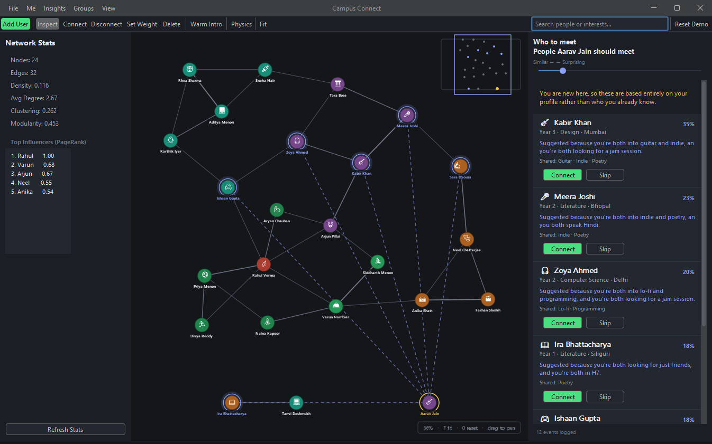

# Campus Connect

**A social recommendation engine for university students, built on graph algorithms.**

A first-year arrives knowing nobody. Somewhere on campus is the person who plays the same
instrument or is stuck on the same course — and they will probably never meet. Campus
Connect is the mechanism that introduces them, and explains why.



### 📖 [Read the full project write-up →](docs/PROJECT.md)

Screenshots, how the matching engine works, why each algorithm is there, the architecture,
and the decisions behind it.

---

## Quick start

```powershell
./run.ps1            # build if needed, then launch
./run.ps1 -Test      # run the 255 verification checks
./run.ps1 -Clean     # force a full rebuild
```

**Controls:** scroll to zoom · drag background to pan · `F` fit · `Ctrl+F` search ·
hover anyone to isolate their part of the network · `?` for all shortcuts.

---

## What it does

| | |
|---|---|
| **Recommends people** | Blends rarity-weighted interest overlap, TF-IDF over bios, shared circumstance, intent, skill exchange and mutual friends — then explains each suggestion in a sentence |
| **Handles newcomers** | A student with zero connections still gets good matches; the structural signal is reweighted away rather than left to produce noise |
| **Maps the campus** | Similarity heatmap relative to you, named friend circles, squads, bridges, isolation |
| **Finds warm introductions** | Dijkstra over `1/strength`, giving the warmest chain of friends rather than the shortest |
| **Surfaces the overlooked** | Inverts the usual question from "what does this user want" to "who is nobody finding" |

**Built with:** Java 21+, Swing, FlatLaf, Gson. No build system — `javac` and a script.

**Verified by:** ten headless harnesses, 255 checks, `./run.ps1 -Test`.

---

## Building manually

If you would rather not use the script:

### Compile (PowerShell):
```powershell
cd PorjectLink
javac -d out -cp "lib/flatlaf-3.5.jar;lib/flatlaf-intellij-themes-3.5.jar;lib/gson-2.11.0.jar" (Get-ChildItem -Recurse -Filter *.java src | ForEach-Object FullName)
```

### Compile (bash / Git Bash):
```bash
cd PorjectLink
javac -d out -cp "lib/flatlaf-3.5.jar;lib/flatlaf-intellij-themes-3.5.jar;lib/gson-2.11.0.jar" $(find src -name "*.java")
```

### Run:
```bash
java -cp "out;lib/flatlaf-3.5.jar;lib/flatlaf-intellij-themes-3.5.jar;lib/gson-2.11.0.jar" CampusConnect.main.Main
```

### Dev harnesses (headless, no window):
```bash
CP="out;lib/flatlaf-3.5.jar;lib/flatlaf-intellij-themes-3.5.jar;lib/gson-2.11.0.jar"
java -cp "$CP" CampusConnect.dev.MatchingHarness   # and nine others -- see docs/PROJECT.md
```

### Adding campus-specific interests
Drop an `interests-custom.json` next to where you run the app — it is merged into the
built-in vocabulary at startup, no recompile needed:
```json
{ "tags": [
  { "id": "rangoli", "label": "Rangoli", "category": "ARTS", "aliases": ["kolam"] }
] }
```
Valid categories: `SPORTS MUSIC GAMING ACADEMICS TECH ARTS FOOD FILM_TV FITNESS
VOLUNTEERING OUTDOORS OTHER`. An id or alias that collides with an existing tag is
rejected loudly rather than silently hijacking it.

### Or in IntelliJ IDEA:
1. Open the project
2. Right-click on `Main.java` → Run 'Main.main()'

### VS Code Note:
If you see red error squiggles in VS Code (like "package com.formdev.flatlaf does not exist"), don't worry! This is just the language server needing time to recognize the external JAR libraries. The code compiles and runs perfectly. Just give it a moment to load, and simply hit Run - it will work fine.
