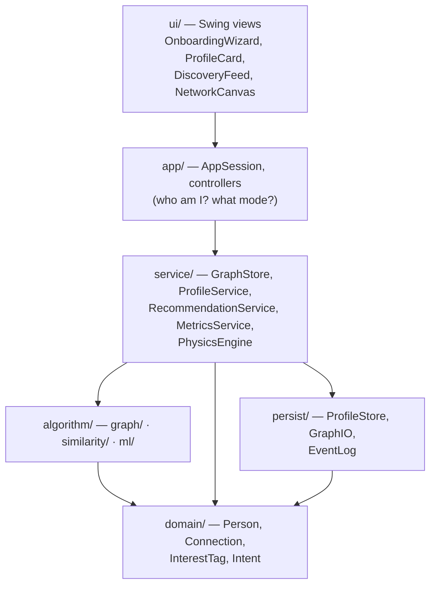
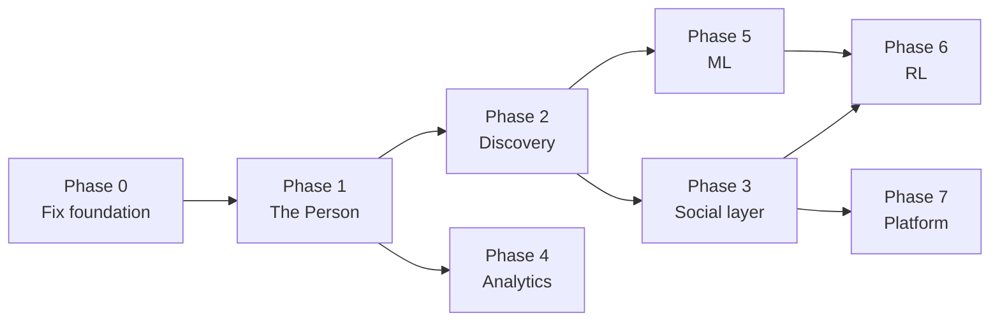

# Campus Connect V2 — From Graph Toy to Social Platform 🚀

> **The one-line vision:** A new student opens the app, writes about who they are, and the
> app tells them *which people on campus they should actually go meet — and why.*

---

## 0. The Core Reframe (read this before anything else)

**V1:** the graph is the product. You manually place nodes and manually wire edges. The
profile fields (`major`, `year`, `interests`) exist in [Person.java](PorjectLink/src/CampusConnect/domain/Person.java)
but there is no UI to fill them in — they are dead weight.

**V2:** the *person* is the product. The graph is what emerges when people describe
themselves and the system helps them find each other.

That single flip changes three things structurally:

| | V1 | V2 |
|---|---|---|
| **Node** | a dot with a name | a profile: bio, interests, intent, year, major, clubs |
| **Edge** | manually drawn, meaningless weight | *requested → accepted*, typed, strength-scored, and often **suggested by the system** |
| **Algorithms** | academic exercises in a menu | the engine behind "You should meet Priya" |

Critically: **we keep everything already built.** Adamic-Adar, Louvain, betweenness,
bridges — none of it gets thrown away. It stops being a Algorithms menu and becomes the
structural half of a recommender. The manual connect/disconnect flow stays too; it just
becomes one of several ways an edge gets created.

### The two-graph model — the key idea

V2 maintains **two overlaid graphs** on the same set of people:

1. **The social graph** — real, accepted connections. This is what V1 has.
2. **The affinity graph** — *latent*, computed, never stored. An edge weight between
   every pair, derived from how similar their profiles are.

Recommendations are: *high affinity, no social edge yet.* That's the whole product in one
sentence, and it's also the exact shape that ML slots into later — you replace the
hand-tuned affinity function with a learned one, and nothing else changes.

---

## 1. Target Architecture

The current [NetworkService.java](PorjectLink/src/CampusConnect/service/NetworkService.java)
is 308 lines doing graph storage **+** physics **+** stats **+** pathfinding. That's fine at
25 nodes; it will not survive profiles, matching, and ML. Split it.



**Non-negotiable rule:** `algorithm/` and `service/` never import `javax.swing`. They
already don't — keep it that way. That discipline is exactly what lets you put a web
front-end or a Python ML sidecar on this later without a rewrite.

---

## 2. The Data Model

This is the foundation. Get it right and everything downstream is easy; get it wrong and
every ML feature in Phase 5 trains on garbage.

### `Person` (replaces `UserNode`)

```java
public class Person {
    // identity
    String id;  String name;  String handle;  String avatarEmoji;  Instant joinedAt;

    // academic
    String major;  String minor;  int year;  List<String> courses;

    // living / context
    String hostel;  String hometown;

    // the human part
    String bio;                        // free text, ~280 chars
    Set<InterestTag> interests;        // NORMALIZED tags, not free strings
    Map<InterestTag,Integer> intensity;// 1..5 "how much do you care"
    Set<String> clubs;
    Set<String> skills;
    EnumSet<Intent> lookingFor;

    // privacy
    EnumSet<Field> hiddenFields;
}

enum Intent { STUDY_PARTNER, PROJECT_TEAM, ROOMMATE, SPORTS_BUDDY,
              JAM_SESSION, MENTOR, MENTEE, JUST_FRIENDS }
```

> **Move physics + computed metrics OFF the person.** `x, y, dx, dy` go into a
> `LayoutState` map owned by `PhysicsEngine`; `rank`, `communityId`, `centrality` go into a
> `NodeMetrics` record keyed by person id. This directly fixes the current bug where all
> four centrality metrics clobber the same `rank` field
> ([MainFrame.java:222-238](PorjectLink/src/CampusConnect/ui/MainFrame.java#L222-L238)).

### `InterestTag` — the highest-leverage, least glamorous piece

Free-text interests are **worthless** for matching. `"bball"`, `"Basketball"`,
`"basket ball"`, and `"hoops"` are four different strings and one interest. If you let
users type freely with no normalization, your similarity scores are noise and every ML
model you train later learns nothing.

```java
public record InterestTag(
    String id,            // "basketball"  — canonical, lowercase, stable
    String label,         // "Basketball"  — display
    Category category,    // SPORTS
    Set<String> aliases   // {"bball","hoops","basket ball"}
) {}

enum Category { SPORTS, MUSIC, GAMING, ACADEMICS, TECH, ARTS,
                FOOD, FILM_TV, FITNESS, VOLUNTEERING, OUTDOORS, OTHER }
```

Ship a curated seed taxonomy of ~150–200 tags in `resources/interests.json`. Let users pick
from an autocomplete; allow free entry but route it through an alias-matcher first
(exact → alias → fuzzy via Levenshtein ≤ 2 → "create new tag"). Review new tags
periodically and fold them into aliases.

### `Connection` (replaces the raw adjacency + weight map)

```java
public class Connection {
    String personA, personB;      // canonical order, reuse Edge.makeKey()
    ConnectionType type;          // FRIEND, CLASSMATE, TEAMMATE, ROOMMATE, MENTOR
    Status status;                // PENDING, ACCEPTED, DECLINED, BLOCKED
    double strength;              // 0..1, replaces the arbitrary weight
    Instant createdAt;
    Origin origin;                // MANUAL | SUGGESTED | IMPORTED
    String suggestionReason;      // "3 mutual friends + both play basketball"
}
```

> **`origin` is a tiny field with an outsized payoff.** It's how you measure whether the
> recommender actually works ("42% of accepted connections came from suggestions"), and
> in Phase 5 it becomes your training-label source. Add it from day one — you cannot
> backfill it.

---

## 3. The Matching Engine

The heart of "suggest who I should connect to." All of this is **pure Java, zero
dependencies** — deliberately, so it runs today and gives ML a baseline to beat later.

### The affinity score

```
affinity(u,v) =  w₁ · interestSim(u,v)      // IDF-weighted Jaccard over tags
              +  w₂ · bioSim(u,v)           // TF-IDF cosine over bio text
              +  w₃ · contextSim(u,v)       // same year / major / hostel / club
              +  w₄ · structuralSim(u,v)    // Adamic-Adar  ← ALREADY BUILT
              +  w₅ · intentMatch(u,v)      // both want STUDY_PARTNER
              −  w₆ · popularityPenalty(v)  // don't just suggest the hub every time
```

**Interest similarity must be IDF-weighted.** Two people both liking "music" tells you
almost nothing — half of campus likes music. Two people both liking "Carnatic fusion" or
"competitive programming" is a *strong* signal. Weight rare shared interests higher:

```
idf(t)            = log( N / (1 + peopleWithTag(t)) )
interestSim(u,v)  = Σ_{t ∈ u∩v} idf(t)  /  Σ_{t ∈ u∪v} idf(t)
```

That's a weighted Jaccard — O(|tags|) per pair, trivially cheap.

**The popularity penalty is not optional.** Without it, every recommendation for every
user converges on the 3 most-connected people on campus. That's the classic popularity-bias
failure mode of naive recommenders, and it makes the product feel broken and useless.

### Cold start — *your exact scenario*

A first-year who just joined has **zero edges**. So `structuralSim` = 0 and every
structural algorithm in the codebase returns nothing useful for them. This is the single
most important case to design for, because it's the moment that decides whether they keep
using the app.

Handle it explicitly with a **content-only fallback**: when `degree(u) < 3`, re-normalize
the weights so `w₁, w₂, w₃, w₅` carry the whole score. The bio and interests they just
typed in during onboarding are all the signal you have — and it's enough.

### Explainability — the cheapest "wow" in the entire project

Never show a bare score. Every suggestion carries a human sentence:

> **Priya Nair** · 2nd yr, Design
> *Suggested because you both play basketball and are into indie music — and you both
> know Rahul.*
> `[ Connect ]  [ Not interested ]`

This is ~30 lines of string building on top of data you already computed, and it is the
difference between "a graph demo" and "a product." It also makes the recommender
*debuggable* — you can see at a glance when it's reasoning badly.

---

## 4. Phased Delivery Plan

Ordered by dependency. Each phase ships something usable on its own.

### Phase 0 — Fix the foundation *(1–2 days)*

You cannot build a profile system on top of broken persistence. These are the bugs from the
codebase review:

| Fix | Where | Why it blocks V2 |
|---|---|---|
| **Load-from-JSON discards the loaded graph** — `loadGraph()` calls `resetView()`, which clears and reloads the default | [MainFrame.java:344-346](PorjectLink/src/CampusConnect/ui/MainFrame.java#L344-L346) | Profiles are worthless if they can't be reloaded |
| `VIEW` mode unreachable after first toolbar click (no button maps to it, `ButtonGroup` can't deselect) | [MainFrame.java:59-64](PorjectLink/src/CampusConnect/ui/MainFrame.java#L59-L64) | Profile viewing is the *primary* interaction in V2 |
| Divide-by-zero → `NaN` in spring force (repulsion clamps `dist`, attraction doesn't) | [NetworkService.java:278](PorjectLink/src/CampusConnect/service/NetworkService.java#L278) | Nodes permanently vanish; unacceptable in a real app |
| All 4 centrality metrics write to `setRank()` | [MainFrame.java:222-238](PorjectLink/src/CampusConnect/ui/MainFrame.java#L222-L238) | `NodeMetrics` split fixes this properly |
| `calculateModularity` is O(V²·deg) and runs on **every** graph change | [StatsPanel.java:110](PorjectLink/src/CampusConnect/ui/StatsPanel.java#L110) | Will stall hard at 500+ people |
| Silent failures: `loadDefaultGraph` swallows exceptions into `printStackTrace` | [MainFrame.java:615](PorjectLink/src/CampusConnect/ui/MainFrame.java#L615) | Silent partial data corrupts the recommender |

**Also:** replace the hand-rolled JSON parser in
[GraphPersistence.java](PorjectLink/src/CampusConnect/service/GraphPersistence.java). It
works for today's flat schema, but nested profiles + tag objects + intensity maps will
break it. Drop in **Gson** or **Jackson** (single JAR, fits the existing `lib/` pattern).

---

### Phase 1 — The Person *(1–2 weeks)* ← **the heart of your idea**

| # | Feature | Detail |
|---|---|---|
| 1.1 | `Person` domain model | Replace `UserNode`; split out `LayoutState` + `NodeMetrics` |
| 1.2 | Interest taxonomy | ~180 seed tags in `resources/interests.json`, alias matcher, fuzzy fallback |
| 1.3 | **Onboarding wizard** | 4-step modal: *Basics → Interests → About You → What are you looking for?* |
| 1.4 | Profile card UI | Replace the raw `JTextArea` dump with a real card: avatar, bio, interest chips, intent badges |
| 1.5 | Profile editor | Edit your own profile anytime |
| 1.6 | **"Me" / session concept** | `AppSession.currentUser` — V1 has no notion of *you*, which a social app fundamentally requires |
| 1.7 | Node rendering v2 | Draw avatar emoji + colour by dominant interest category, size by connection count |
| 1.8 | Rich persistence | Full profile round-trip through the new JSON layer |

**Onboarding is the make-or-break screen.** Your "kid who just came to college" writes
their bio and picks interests here. Design goals: under 90 seconds, skippable fields,
autocomplete everywhere, and — the moment they hit finish — **immediately show them 5
people they should meet.** Never drop a new user onto an empty canvas.

---

### Phase 2 — Discovery & Matching *(1–2 weeks)*

| # | Feature | Detail |
|---|---|---|
| 2.1 | `SimilarityEngine` | IDF-weighted interest Jaccard, TF-IDF bio cosine, context sim |
| 2.2 | `RecommendationService` | The hybrid blend above, with cold-start reweighting |
| 2.3 | **Explanation generator** | Human-readable reason string for every suggestion |
| 2.4 | **Discovery feed panel** | Scrollable card list: "People You Should Meet", with Connect / Dismiss |
| 2.5 | Affinity overlay on canvas | Toggle: draw dashed "potential connection" edges to your top-N matches |
| 2.6 | Search + filter | By name, interest, major, year, intent |
| 2.7 | Interest explorer | Click "Basketball" → see everyone who plays, connect from there |
| 2.8 | Recommendation cache | Invalidate on profile/edge change — **do not** recompute TF-IDF per repaint |

At the end of Phase 2 you have the actual product you described. Everything after this is
depth.

---

### Phase 3 — The Social Layer *(1 week)*

| # | Feature | Detail |
|---|---|---|
| 3.1 | Connection requests | `PENDING → ACCEPTED / DECLINED` state machine; edges stop being instant |
| 3.2 | Typed connections | Friend / classmate / teammate / roommate / mentor, rendered differently |
| 3.3 | Connection strength | Derived from shared interests + mutual friends + interaction, not typed in by hand |
| 3.4 | **Interest groups** | Bipartite person↔interest graph; project it to find natural clubs — a genuinely nice CS flex |
| 3.5 | Icebreakers | Auto-generated opener from shared interests |
| 3.6 | Mutual friends view | Wire up the already-written but unused `findMutualFriends()` |
| 3.7 | Activity feed | "Rahul joined", "Priya added Photography" |

---

### Phase 4 — Analytics, Reframed for Humans *(4–5 days)*

Every algorithm already in the codebase, re-presented as something a student actually cares
about. **This phase is almost entirely UI work over existing code** — highest impact-to-effort
ratio in the whole plan.

| Existing algorithm | V1 presentation | V2 presentation |
|---|---|---|
| Louvain communities | "Communities detected." | **"Your circles"** — auto-named by each cluster's top-IDF shared interest: *"The Late-Night Coders"*, *"The Football Crowd"* |
| Betweenness centrality | a number | **"You're the only bridge between the Music crowd and the CS crowd"** |
| BFS n-hop | — | **"You're 2 handshakes from 340 people on campus"** |
| Bridges / articulation pts | red lines | **"If Rahul leaves, these 6 people lose touch with the rest"** |
| PageRank | heatmap | **"Most connected people in your year"** |
| Diameter / radius | two integers | **"Campus is 4 handshakes wide"** |
| Clustering coefficient | 0.43 | **"Your friends mostly all know each other"** (tight vs. broad network) |

Plus: personal dashboard, degree-distribution chart, community pie chart, growth timeline.

---

### Phase 5 — Machine Learning *(2–4 weeks)*

Only start once Phase 2 is live — **you need the heuristic baseline to beat and the
interaction data to train on.** ML without a baseline is unfalsifiable.

| # | Feature | Approach |
|---|---|---|
| 5.1 | Feature pipeline | Per-pair vectors: degree, common neighbours, Adamic-Adar, interest sim, bio sim, same-year, same-major, community match |
| 5.2 | **Link prediction** | Logistic regression, pure Java (~200 lines). Positives = existing edges; negatives = sampled non-edges. Evaluate with AUC + precision@k |
| 5.3 | **Learned ranking** | Replace hand-tuned `w₁…w₆` with learned weights. Same interface — just a better `affinity()` |
| 5.4 | Node2Vec embeddings | Biased random walks + skip-gram w/ negative sampling. Very implementable in pure Java |
| 5.5 | Embedding visualization | PCA/t-SNE to 2D — a second canvas view where distance = similarity |
| 5.6 | Semantic bio matching | Upgrade TF-IDF → sentence embeddings (MiniLM via **ONNX Runtime** or **DJL**). "loves basketball" then matches "into sports" |
| 5.7 | Churn / at-risk detection | Flag isolated students the network is failing — *genuinely socially useful* |
| 5.8 | Auto-tagging | Extract interest tags from free-text bios |

> **Java ML is real** — ONNX Runtime and DJL both have solid Maven artifacts. But 5.2/5.3
> should be hand-written: a from-scratch logistic regression is ~200 lines, has zero
> dependencies, and demonstrates far more understanding than importing a library.

---

### Phase 6 — Reinforcement Learning & Feedback Loops *(2–3 weeks)*

This is where it gets genuinely sophisticated, and it depends on Phase 3's accept/dismiss
data.

| # | Feature | Approach |
|---|---|---|
| 6.1 | Implicit feedback log | Every suggestion shown / accepted / dismissed → `EventLog` |
| 6.2 | **Contextual bandit** | ε-greedy → Thompson sampling / LinUCB over recommendation *strategies* |
| 6.3 | Explore vs. exploit | Show the safe pick (3 mutual friends) or the interesting long-shot (rare shared interest, no mutuals)? **This is the natural, honest RL framing for this problem** |
| 6.4 | Influence maximization | Greedy seed selection — "who should we tell about the fest to reach the most people?" |
| 6.5 | Diffusion simulation | Animated independent-cascade / linear-threshold spread |
| 6.6 | RL graph layout | Agent learns node placement minimizing edge crossings — alternative to force-directed |

---

### Phase 7 — Platform *(open-ended)*

Multi-user (real accounts, not one local session) · SQLite or Postgres via a repository
interface · REST service extracted from `service/` · web or mobile client · admin/moderation
tooling · privacy controls and consent.

---

## 5. Dependency Graph



**Critical path to a demoable product: Phase 0 → 1 → 2.** That's roughly 3–4 weeks and it
delivers the entire idea you described. Phases 4 and 5 are what make it interview-proof.

---

## 6. Traps That Will Bite You

Ranked by how much damage they do:

1. **Free-text interests with no normalization.** Kills matching, kills ML, unrecoverable
   without a data migration. Build the taxonomy *first*.
2. **No popularity penalty.** Every user gets suggested the same 3 hubs. Feels broken.
3. **Ignoring cold start.** Your headline user — the new first-year — is exactly the
   zero-edge case where structural algorithms return nothing.
4. **Recomputing similarity on every repaint.** The physics timer fires at 33 fps
   ([MainFrame.java:163](PorjectLink/src/CampusConnect/ui/MainFrame.java#L163)). Cache
   aggressively, invalidate on write.
5. **O(n²) everywhere.** Affinity over all pairs is 500k comparisons at 1,000 people.
   Fine for a demo; blocks any point beyond it. Bucket candidates by shared interest tag
   (an inverted index) before scoring.
6. **Swing.** Card-based social UI in Swing is genuinely painful. It's doable — and the
   clean service layer means a web front-end later is a port, not a rewrite. Just know the
   cost going in.
7. **Building ML before the baseline.** Without the Phase 2 heuristic to compare against,
   you can't tell whether a model helps.
8. **Privacy as an afterthought.** Bios and interests are personal data. Visibility flags
   from day one; they're near-impossible to retrofit.

---

## 7. Where to Start Monday

Concrete first sprint, in order:

1. Fix the load-from-JSON bug — **30 minutes**, unblocks all persistence work.
2. Write `resources/interests.json` with ~180 tags across 12 categories — **2 hours**,
   the single highest-leverage file in the project.
3. `Person` + `InterestTag` + `Intent` domain classes; migrate `UserNode` — **half a day**.
4. Swap in Gson and rewrite `GraphPersistence` for the new model — **half a day**.
5. Onboarding wizard, 4 steps — **1–2 days**.
6. `SimilarityEngine.interestSim()` with IDF weighting — **2 hours**, and the moment you
   have it, print the top-5 matches for each seeded student to console. **That's your first
   proof the whole idea works.**

Steps 1–6 are about a week and take you from "graph demo" to "it actually suggests people."
Everything in this document builds on that week.

---

## 8. What We're Deliberately Not Doing

Cut for focus — reconsider only after Phase 5:

- Messaging / chat (huge scope, tangential to the graph thesis)
- Computer vision (roadmap V1 #86–87) — no clear payoff here
- Graph autoencoders / VAE synthetic generation — impressive but disconnected from the product
- Directed "follow" edges — mutual connections model campus friendship better
- Real-time multi-user sync before Phase 7

---

## 9. Feature Coverage vs. V1 Roadmap

The original 87 features are not discarded — they're **re-sequenced around a product
thesis** instead of listed as isolated algorithms.

| V1 Roadmap section | Fate in V2 |
|---|---|
| Advanced Graph Algorithms (1–18) | Mostly built; **reframed as the structural half of the recommender** (Phase 4) |
| Social Network Features (19–28) | **Now the core product** — Phases 1, 2, 3 |
| Persistence & Export (29–34) | Phase 0 rewrite + Phase 1 rich profiles |
| Analytics Dashboard (35–41) | Phase 4, reframed in human language |
| Performance (42–48) | Deferred; revisit when scale demands (trap #5) |
| Advanced UX (49–59) | Phase 2 (search, filters) + Phase 3 |
| Systems Engineering (60–65) | Phase 0 (event log, tests) + Phase 7 |
| AI: GNN & Embeddings (66–70) | Phase 5 |
| AI: NLP (71–75) | Phase 5 (semantic matching, auto-tagging) |
| AI: Predictive (76–80) | Phase 5 (churn, link prediction, influence max) |
| AI: RL (81–82) | Phase 6 |
| AI: Generative (83–85) | Cut for now |
| AI: Computer Vision (86–87) | Cut |

---

## 10. Why This Version Is Actually Better

The V1 roadmap was a list of 87 algorithms. Impressive, but it reads as *"I implemented
things."*

V2 tells a story: **a real problem** (new students don't know who to meet), **a real
solution** (hybrid content + structural recommendation with explanations), **real
engineering** (layered architecture, cold-start handling, popularity debiasing, caching),
and **a real ML path** (baseline → features → learned ranking → embeddings → bandits).

The graph algorithms are *still all there* — they just have a reason to exist now. That's
the difference between a project and a product.
