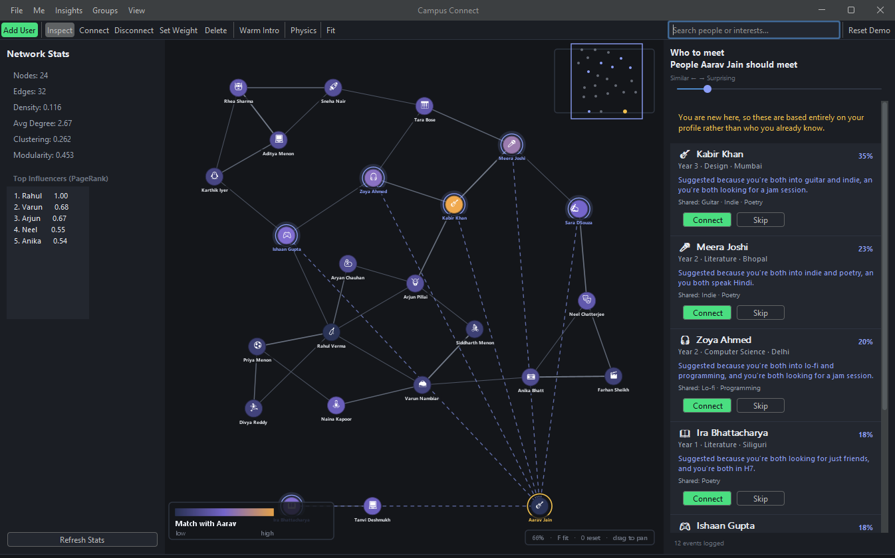
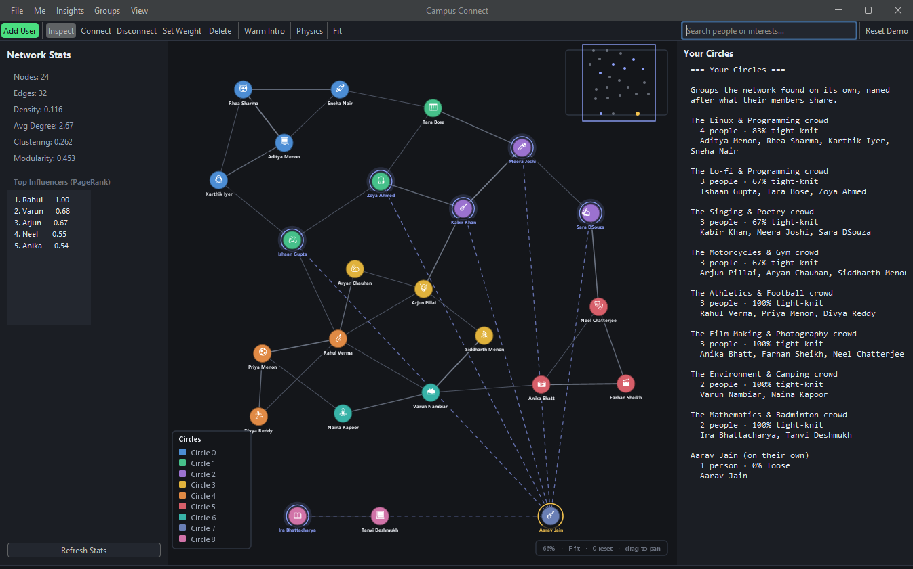
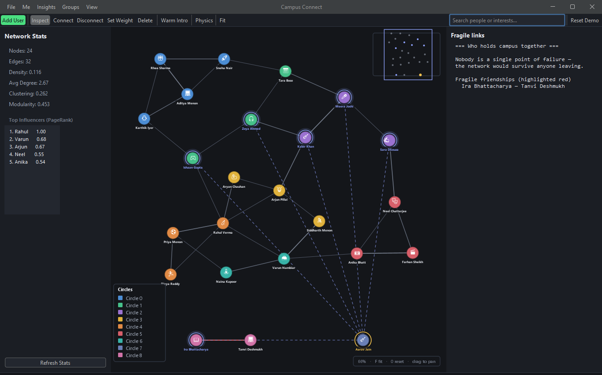
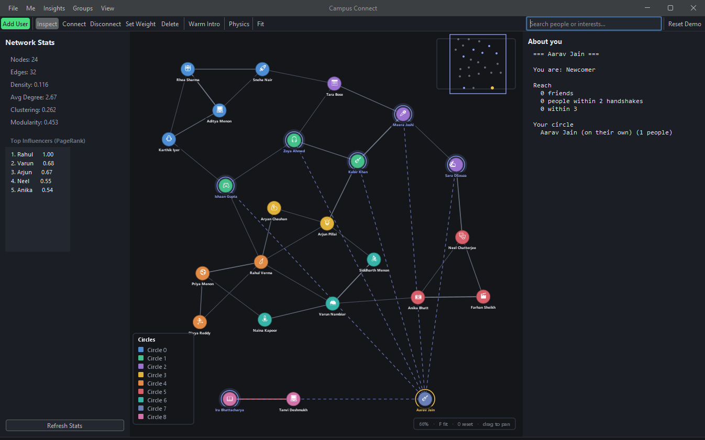
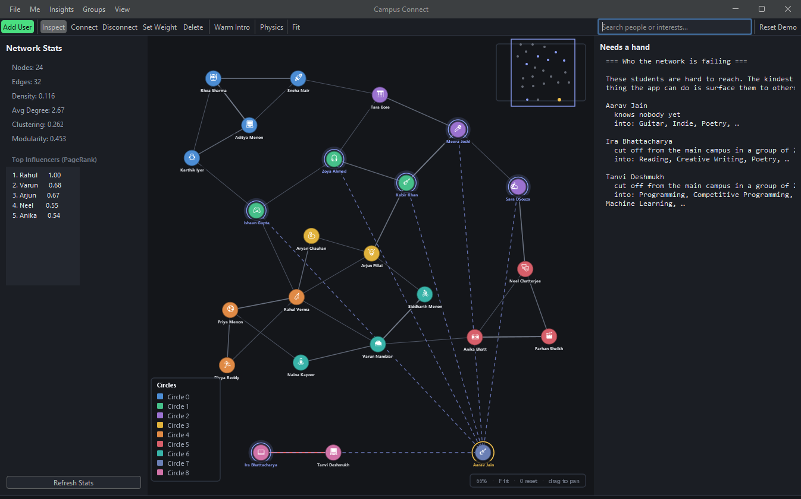
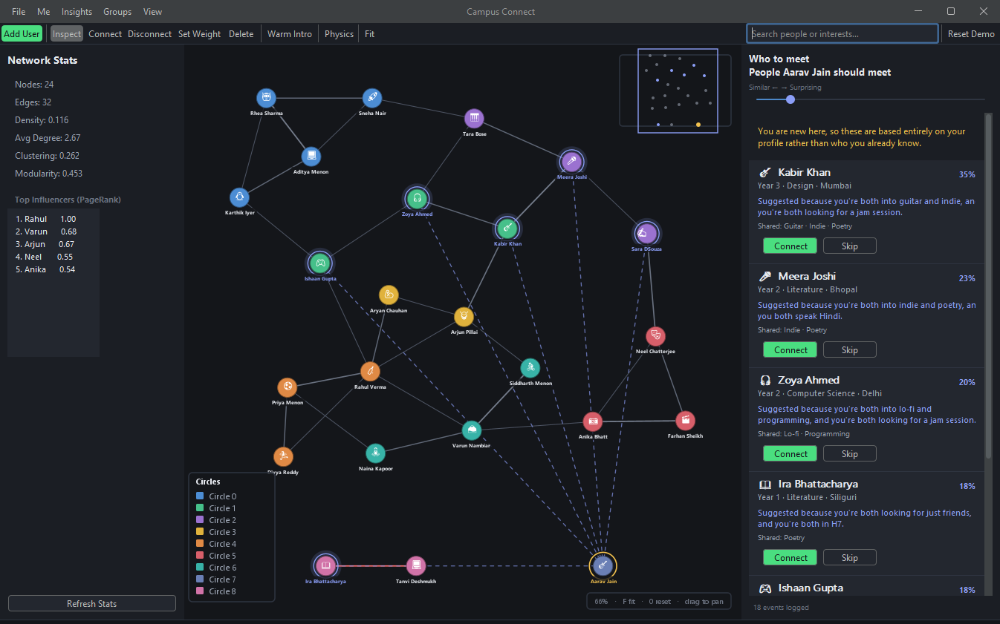

# Campus Connect

**A social recommendation engine for university students, built on graph algorithms.**

A first-year arrives knowing nobody. Somewhere on campus is the person who plays the same
obscure instrument, is stuck on the same course, or comes from the same town — and they
will probably never meet, because there is no mechanism for it beyond luck.

Campus Connect is that mechanism. Students describe themselves; the app works out who they
should meet, and tells them **why**.


*Signed in as Aarav, a first-year with zero connections. Every suggestion on the right comes
from his profile alone — the graph knows nothing about him yet.*

---

## Contents

- [The problem](#the-problem)
- [The core idea: two graphs](#the-core-idea-two-graphs)
- [How the matching works](#how-the-matching-works)
- [Walkthrough](#walkthrough)
- [The algorithms, and why each one is there](#the-algorithms-and-why-each-one-is-there)
- [Architecture](#architecture)
- [Decisions worth explaining](#decisions-worth-explaining)
- [How it is tested](#how-it-is-tested)
- [Running it](#running-it)
- [Where it goes next](#where-it-goes-next)

---

## The problem

The project started as a graph visualiser: nodes were dots, you wired them together by
hand, and BFS found paths between them. It demonstrated data structures and nothing else.
Every node was interchangeable, so every edge was arbitrary, so the graph did not
represent anything.

The turn came from asking what the graph would have to *be* for the algorithms to matter.
If a node is a person with interests and a history, then a shortest path becomes a chain
of introductions, a community becomes a friend group, and an isolated node becomes a
student nobody has found.

So the rebuild had one rule:

> **If an algorithm's output cannot be phrased as a sentence about a specific person, it
> does not belong in the interface.**

That single test removed several features and reframed the rest. "Modularity: 0.412" is a
true statement that answers nobody's question. "The Trekking & Camping crowd — 3 people,
tight-knit" is the same Louvain result, and it is a feature.

---

## The core idea: two graphs

The system maintains **two graphs over the same set of people**.

| | What it is | Where it lives |
|---|---|---|
| **Social graph** | Real, accepted connections | Stored — the adjacency list |
| **Affinity graph** | How well any two people would get on | Computed on demand, never stored |

A recommendation is simply: **high affinity, no social edge yet.**

That framing does most of the design work. The social graph stays the trusted substrate —
it is ground truth, and it is what the structural algorithms run on. The affinity graph is
derived from profiles and can be recomputed freely. And because affinity is one function
behind one set of weights, replacing hand-tuned weights with a learned model later changes
that function and nothing else.

---

## How the matching works

Affinity blends six signals:

```
affinity(u,v) =  w₁ · interestSim     rarity-weighted interest overlap
              +  w₂ · bioSim          TF-IDF cosine over free-text bios
              +  w₃ · contextSim      course, year, hostel, home town, language
              +  w₄ · structuralSim   Adamic-Adar over mutual friends
              +  w₅ · intentMatch     both looking for the same thing
              +  w₆ · teachLearn      one can teach what the other wants to learn
              −  w₇ · popularity      damping for the already over-connected
```

### Rare interests count for more

The first version used plain Jaccard overlap and produced bad results, for a reason that
is obvious in hindsight: **half of campus likes music.** Two people both liking "music"
tells you nothing. Two people who both do competitive programming have told you something
real. Unweighted overlap treats those identically.

The fix is the same idea search engines use for words — inverse document frequency:

```
idf(t)           = log( N / (1 + peopleWithTag(t)) )
interestSim(u,v) = Σ_{t ∈ u∩v} idf(t) · min(iᵤ,iᵥ)  /  Σ_{t ∈ u∪v} idf(t) · max(iᵤ,iᵥ)
```

Each person also rates how much they care about an interest from 1 to 5, folded in above,
so "plays every day" outranks "tried it once".

### The cold-start problem

**A new student has no connections, so every structural algorithm returns nothing for
them** — which is precisely the person the product exists for.

Worse, leaving the structural term in place makes it actively harmful: it contributes zero
but still consumes its share of the weight, so every candidate scores low and the ranking
degenerates into noise. When someone has fewer than three connections, its weight is
redistributed across the profile terms instead.

That is why the screenshot above works. Aarav has **zero** friends, and four of his top
five suggestions are musicians — reached entirely from a bio and five interest tags.

### Two failure modes that had to be designed against

**Popularity bias.** The best-connected person shares mutual friends with almost everyone,
so without a penalty they top every single list. The first attempt used
`degree / maxDegree`, which overcorrected badly — it charged every ordinary person a fee
for having friends and hit the most connected person so hard they vanished from all 24
lists. That is the same failure inverted. Only *above-average* degree is penalised now.

**Scale sensitivity.** A later "isolation nudge" — a small boost for students the network
is failing — was added as a flat number. It worked, until the campus was resized from 40
people to 24, scores compressed, and that same constant became a third of a whole score,
putting one friendless student at the top of 21 of 24 feeds. It is a *multiplier* now, so
it can lift a near-tie but never hoist an unrelated person above a genuine match.

Both were caught by an automated check that measures the *effect* rather than asserting a
number — see [How it is tested](#how-it-is-tested).

### Every suggestion explains itself

> *"Suggested because you're both into guitar and indie, and you're both looking for a jam
> session."*

This costs almost nothing — every fact in it was already computed to produce the score —
and it does two jobs. Users get a reason to actually walk over and say hello. And the
recommender becomes debuggable by eye: a bad suggestion with a stated reason immediately
shows *which signal* misfired.

---

## Walkthrough

### Similarity map



The whole campus, coloured by how well each person matches **you**. The other heatmaps
describe the network — who is influential, who bridges groups. This one describes it from
where the viewer is standing, which is the only version that answers a student's actual
question.

It shares its scoring function with the ranked list, so the two views cannot disagree —
the hottest stranger on the map is always the top of the feed.

### Your circles



Louvain community detection, with each cluster **named after what its members share**.
Names come from the interest with the highest *coverage × rarity* in the group: coverage
alone would name half the circles "Programming", rarity alone would pick something one
member happens to like.

Density is reported as advice rather than a number — a very tight group is hard to break
into, a loose one is a good place to introduce people.

### Who holds campus together



Tarjan's bridge-finding and articulation points, phrased as consequence: *if these people
left, others would lose touch with the rest of campus*. Fragile connections are drawn in
red on the graph.

### What am I in this network?



Degree, betweenness and clustering coefficient are three numbers nobody would read on
their own. Combined, they produce a single word — **Connector**, **The Bridge**,
**Explorer**, **Loyalist**, **Newcomer** — plus reach at one, two and three handshakes.

### Who the network is failing



This one inverts the usual question. A recommender normally asks *what does this user
want*. This asks *who is nobody finding* — and the graph already knew, it had just never
been asked. Those students are then given a small boost in everybody else's suggestions,
so the network works to pull in the people it is failing rather than only serving whoever
is already well connected.

### The discovery feed



The core loop: a face, a reason, connect or skip. The **serendipity slider** is the
explore/exploit tradeoff exposed as a control — left for people much like you, right for
people you would otherwise never meet. Turning it up damps the structural term and rewards
candidates with no mutual friends.

Every suggestion shown, accepted and dismissed is logged, with the reason on each
rejection. "Not my thing" means the interest weighting misfired; "I already know them"
means the graph is missing an edge — different failures with different fixes, and the
second one offers to add the connection.

---

## The algorithms, and why each one is there

Each of these was added to answer a specific question, not to tick a box.

| Question | Algorithm | Why this one |
|---|---|---|
| Who should I meet? | IDF-weighted Jaccard + TF-IDF cosine | Rarity weighting is what separates signal from "we both like music" |
| Which mutual friends actually mean something? | **Adamic-Adar** | A mutual friend who knows everybody is weak evidence; one who knows six people is strong. Same rarity argument as IDF |
| Who are my friend groups? | **Louvain** | Finds communities by optimising modularity, no need to guess how many exist |
| Which groups are real? | **Bron-Kerbosch** (maximal cliques) | A clique of five is not an abstraction — it is five people who all genuinely know each other |
| Who holds the network together? | **Tarjan** (bridges, articulation points) | Identifies single points of failure directly |
| Who is important? | **PageRank**, **Brandes' betweenness** | Betweenness is the interesting one: it finds bridges *between* groups, which degree cannot |
| How do I get introduced? | **Dijkstra**, on `1/strength` | See below |
| Who is stranded? | Connected components + degree | Cheap, and exactly the right tool |

### The Dijkstra detail

Warm introductions are the one that changed most in the rebuild.

Edge weight in this graph is friendship *strength* — higher means closer. Shortest-path
algorithms want a **cost**, where lower is better. The original code ran Dijkstra directly
on the raw weights, which meant it was systematically preferring the **weakest** links in
the graph and calling the result a shortest path.

Traversing an edge now costs `1 / strength`, which produces the *warmest* chain rather than
the shortest:

> *"Ask Arjun Pillai, who knows Aryan Chauhan, who knows Rahul Verma, to introduce you to
> Priya Menon."*

A four-step chain through close friends is a far better route to an introduction than a
two-step chain through people who barely speak. That is the whole point, and it only works
because the cost function matches what the number actually means.

---

## Architecture

```
CampusConnect/
├── domain/       Person, InterestTag, InterestCatalog, Group, NodeMetrics, Intent
├── app/          AppSession                     — who is using the app
├── service/      NetworkService (graph + physics), RecommendationService,
│                 InsightService, GroupService, ConnectionService, ExplanationBuilder
├── algorithm/
│   ├── graph/      PageRank, Centrality, Community, GraphAnalyzer, Dijkstra
│   └── similarity/ InterestSimilarity, TfIdf, SimilarityEngine
├── persist/      GraphIO, CampusSeed, EventLog, InterestCatalogLoader
├── ui/           Theme, MainFrame, NetworkCanvas, Viewport, DiscoveryPanel,
│                 ProfileCard, OnboardingWizard, SearchBox, Toast
└── dev/          ten verification harnesses
```

**One rule enforced throughout:** nothing in `domain/`, `service/`, `algorithm/` or
`persist/` imports `javax.swing`. The engine has no idea a UI exists. That single
constraint is what would make a web front-end or a Python ML sidecar a *port* rather than
a rewrite — and it is why the entire matching engine could be built and validated with no
interface at all.

**Built with:** Java 21+, Swing, FlatLaf (theming), Gson (persistence). No build system —
`javac` and a PowerShell script, deliberately, so the project has no setup step.

---

## Decisions worth explaining

These are the ones with a real trade-off behind them.

**A controlled interest vocabulary, not free text.** `bball`, `Basket Ball`, `hoops` and
`BASKETBALL` are four strings and one interest. Stored raw, two people who both play
basketball look like they have nothing in common, and every similarity score is computed
over noise. 192 curated tags with 273 aliases and a four-stage resolver — exact id, alias,
normalised, then bounded fuzzy — mean the data is clean *by construction* rather than by
cleanup. Edit tolerance scales with word length and is zero below five characters, because
"chess" and "chest" are one edit apart and mean different things.

**The catalog refuses to start if two tags claim the same alias.** A hijacked alias routes
an interest to the wrong tag permanently and is completely invisible when reading a
192-row table. Failing loudly at startup beats debugging bad recommendations three
features later.

**Interests are one `Map<Tag,Intensity>`, not a Set plus a parallel map.** Two structures
that must stay in agreement eventually won't, and the resulting skew in similarity scores
would never surface as an error — just quietly worse suggestions.

**Persistence uses explicit DTOs rather than reflecting over the domain object.**
Reflection would serialise computed metrics (stale the moment the graph changes) and
physics velocity (meaningless across sessions), and inline every interest with all its
aliases so one vocabulary edit would invalidate every saved file. Canonical tag *ids* are
persisted, never display labels — labels get reworded, ids are the contract.

**The graph lives in a fixed world, not the window.** The layout engine was originally
handed the *component* size as its bounds, so shrinking the window did not scroll the graph
— it crushed it, clamping every node into less space until the layout meant nothing. The
world is now a fixed size and a camera decides how much of it you see.

**The demo campus is hand-authored, not generated.** A recommender cannot be evaluated
against 25 nodes named Alice..Yara with no profiles — every suggestion looks equally
arbitrary. The 24 students are shaped so that specific answers are *checkable by eye*: one
student with zero connections, one deliberate hub, complementary teach/learn pairs, and
overlapping-but-not-identical interests so scores spread out instead of tying.

---

## How it is tested

There is no JUnit here. Instead there are **ten headless harnesses, 255 checks**, run with
one command:

```
./run.ps1 -Test
```

```
InterestCatalogHarness   36   vocabulary and resolver
SeedHarness              32   campus shape, profile round-trip
PhysicsHarness            8   layout stability
ViewportHarness          21   camera maths
MatchingHarness          22   recommendations and heatmap
DiscoveryHarness         22   serendipity, event log
InsightHarness           30   circles, squads, archetypes
GroupHarness             30   groups and fit
ConnectionHarness        31   intros, requests, isolation nudge
UiHarness                23   session and component construction
```

The more interesting principle is **what** they check. Several early checks passed for the
wrong reasons and had to be replaced:

- *"The hub does not dominate suggestions"* passed trivially — the hub was already friends
  with everyone he would match, so he was filtered as an existing friend whether or not
  the popularity penalty existed. Replaced with an **A/B measurement**: mean degree of
  everybody suggested, penalty on versus off (3.085 → 2.810). That tests the mechanism
  instead of a coincidence.
- *"25+ distinct people appear across all lists"* silently encoded that the campus had 40
  people, and broke the moment it didn't. Thresholds are relative to population now.

Bugs these caught that reading the code did not: a force-directed layout that diverged to
10¹² kinetic energy, a divide-by-zero that made nodes vanish, save-then-load silently
discarding the file, and both recommender biases described above.

---

## Running it

```powershell
git clone <repo>
cd projectLink
./run.ps1
```

Builds if needed, then launches. `./run.ps1 -Test` runs the harnesses.

**Controls:** scroll to zoom · drag the background to pan · `F` fit · `Ctrl+F` search ·
hover anyone to isolate their corner of the network · `?` for the full list.

---

## Where it goes next

The architecture was shaped for this and the groundwork is already in place.

`EventLog` has been recording every suggestion shown, accepted and dismissed since the feed
was built — with the score at the time and a reason on each rejection. That is a labelled
dataset, and it cannot be reconstructed after the fact, which is why it started collecting
long before anything read it.

1. **Link prediction** — logistic regression over pair features (common neighbours,
   Adamic-Adar, interest similarity, same year, community match). Positives are existing
   edges, negatives are sampled non-edges. Evaluated on AUC and precision@k.
2. **Learned ranking** — replace the hand-tuned weights with fitted ones. Same interface,
   one method changes.
3. **Node2Vec embeddings** — biased random walks and skip-gram, then cosine similarity in
   embedding space, which captures structural equivalence that Jaccard cannot.
4. **Sentence embeddings for bios** — the current TF-IDF is lexical, so "loves basketball"
   and "into sports" score zero against each other. Having the lexical baseline first is
   what makes it possible to prove embeddings actually earn their weight.
5. **Contextual bandit** on the serendipity axis — the dial already exists as a control and
   its outcomes are already logged.

The rule for all of it: **the current heuristic is the baseline.** A model that cannot beat
it does not ship, because without that comparison "we added machine learning" is an
unfalsifiable claim.
